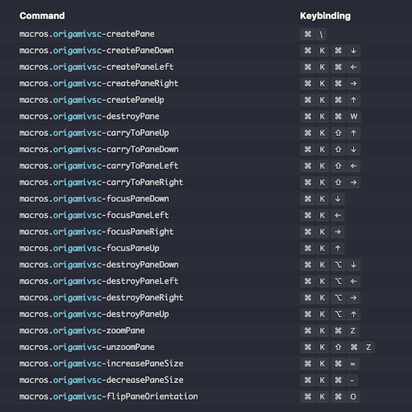

# OrigamiVSC

Like [Origami](https://github.com/SublimeText/Origami) but for VS Code.

**DISCLAIMER**

This is **not** an extension. It is also nowhere near as complex as Origami and is a basic solution that fits my own needs.

This means that I don't guarantee that things will work on your machine as they do on mine.

I also don't take responsibility for any chaos on your machine thanks to this hacky solution. 🤷‍♂

I'm hoping that someone will take notice of this and build a proper extension. 🙏

## How to install
1. Install the [macros](https://github.com/geddski/macros) VS Code extension by going [here](https://marketplace.visualstudio.com/items?itemName=geddski.macros).
2. Copy the contents of this [keybindings.json](keybindings.json) to your keybindings.json.
3. Copy the contents of this [settings.json](settings.json) to your settings.json.
4. Done 🎉

# Please Note
1. I have only tested this on macOS.
2. You will only be able to create empty panes if you set the `workbench.editor.closeEmptyGroups` setting to `false`  otherwise the `origamivsc-createPane` command won't work.
3. If the above is set to `false` then you will then have to close panes manually using the `origami-destroyPane` command.

## Features
- [x] Creating Panes
- [x] Destroying the currently selected pane.
- [x] Focusing panes
- [x] Carrying (moving) files to different panes 
- [x] Changing the size of a pane
- [x] Zooming in on a pane
- [ ] Destroying non-selected panes
- [ ] Cloning Panes
- [ ] Merging Panes

## Key shortcuts
Below are the current keybindings for OrigamiVSC.

## Special Thanks
Thanks to the creators of both Origami and the macros VS Code extension for making such awesome software.

## Resources that helped me put this together
- https://github.com/Microsoft/vscode/issues/2755
- https://github.com/Microsoft/vscode/issues/23243
- https://github.com/Microsoft/vscode/issues/53728
- https://code.visualstudio.com/docs/getstarted/settings
- https://code.visualstudio.com/docs/getstarted/keybindings
- https://stackoverflow.com/questions/40709351/vscode-how-to-split-editor-vertically
- https://github.com/Microsoft/vscode/blob/fc251d651d3a7acf9cf12e176e63bc3277ff800a/src/vs/workbench/browser/parts/editor/editorActions.ts
- https://github.com/Microsoft/vscode/blob/c63c97c12848e85769e717209b73110e83c18ef6/src/vs/workbench/common/editor/editorGroup.ts
- https://github.com/Microsoft/vscode/blob/2c93ec4a2dc119067a5853ae510a9ea27ed0c1c6/src/vs/workbench/browser/parts/editor/editorGroupView.ts
- https://github.com/Microsoft/vscode/blob/1e2b78d601ab709ef860181a71bc305d193f52b2/src/vs/workbench/browser/parts/editor/editorCommands.ts
